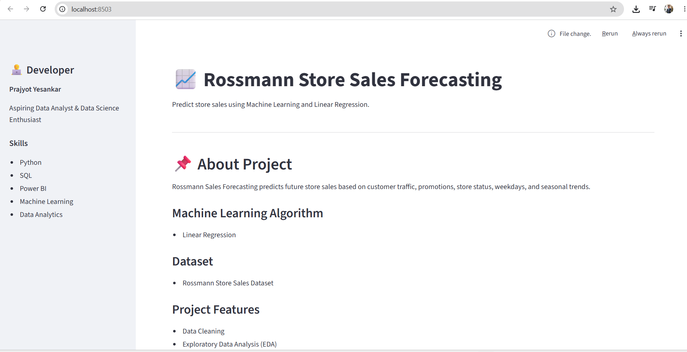
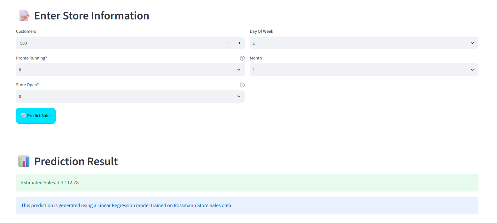

# 📈 Rossmann Store Sales Forecasting

A Machine Learning web application that predicts future store sales using Linear Regression and Streamlit.

---

# 🚀 Live Demo

### 🌐 Live Application

https://rossmann-sales-prajyot.streamlit.app/

---

# 📌 Project Overview

Rossmann Store Sales Forecasting predicts future sales based on store and business-related factors.

The model helps businesses estimate sales performance using historical retail data and machine learning techniques.

### Features Used

- Customers
- Promo
- Open
- DayOfWeek
- Month

---

# 🎯 Business Problem

Rossmann operates thousands of retail stores and needs accurate sales forecasting.

Without forecasting:

- Inventory shortages can occur
- Overstocking increases costs
- Promotion planning becomes difficult
- Revenue forecasting becomes less accurate

The challenge is to predict daily store sales using historical retail data.

---

# 🎯 Project Objective

The objective of this project is to build a Machine Learning model that predicts future store sales using:

- Number of Customers
- Promotions
- Store Open Status
- Day Of Week
- Month

The goal is to support better business decisions through data-driven forecasting.

---

# 🔍 What I Did

## Data Analysis

- Explored Rossmann sales dataset
- Identified important sales-driving factors
- Analyzed customer behavior patterns
- Studied promotion impact on sales

## Data Cleaning

- Checked missing values
- Removed inconsistencies
- Prepared data for modeling

## Feature Engineering

Created useful features:

- Month
- Day Of Week
- Promo Status
- Store Open Status

## Exploratory Data Analysis (EDA)

Performed:

- Correlation Analysis
- Monthly Sales Analysis
- Promotion Impact Analysis
- Customer vs Sales Analysis

## Machine Learning

- Train-Test Split (80:20)
- Linear Regression Model
- Model Evaluation

## Deployment

- Saved model using Joblib
- Built Streamlit Web Application
- Enabled Real-Time Sales Prediction

---

# 📈 Key Findings

### Customer Count

Customer count showed the strongest positive relationship with sales.

### Promotions

Stores running promotions generated significantly higher sales.

### Store Status

Closed stores generated very low or zero sales.

### Seasonality

Sales showed noticeable monthly variations.

---

# 📊 SQL Analysis

SQL was used to analyze the Rossmann dataset and generate business insights before model development.

### Analysis Performed

- Promotion Impact on Sales
- Day-wise Sales Analysis
- Top Performing Stores
- Average Sales by Store
- Open vs Closed Store Analysis
- Customer Behavior Analysis
- High Revenue Store Identification

### Tools Used

- PostgreSQL
- SQL
- pgAdmin

### Sample Query

```sql
SELECT
    promo,
    AVG(sales) AS avg_sales
FROM rossmann
GROUP BY promo;
```

---

# 📊 Dataset

Dataset: Rossmann Store Sales Dataset

Includes:

- Store Information
- Customer Count
- Promotions
- Open/Closed Status
- Date Information
- Sales Records

---

# ⚙️ Machine Learning Workflow

1. Data Collection
2. Data Cleaning
3. Exploratory Data Analysis
4. Feature Engineering
5. Train-Test Split
6. Linear Regression
7. Model Evaluation
8. Streamlit Deployment

---

# 🏆 Results

### Algorithm

- Linear Regression

### Performance

- R² Score: 0.8555
- RMSE: 1484.46

The model successfully explains approximately 85.55% of the variation in store sales.

---

# 💡 Business Impact

This solution helps businesses:

- Forecast Future Sales
- Optimize Inventory Management
- Improve Promotion Planning
- Support Business Decision Making
- Improve Operational Efficiency

---

# 📸 Application Preview

## Homepage



---

## Prediction Result



---

# 📈 Future Improvements

Future enhancements for this project include:

- Advanced Machine Learning Models (Random Forest, XGBoost)
- Hyperparameter Tuning
- Interactive Power BI Dashboard
- Automated Data Pipeline
- Cloud Deployment
- Real-Time Sales Forecasting
- Additional Feature Engineering

---

# 📂 Project Structure

```text
Rossmann_Sales_Forecasting/

├── app.py
├── train_model.py
├── requirements.txt
├── README.md

├── data/
│   ├── train.csv
│   └── store.csv

├── model/
│   └── sales_model.pkl

├── sql/
│   └── analysis.sql

├── notebooks/
│   └── Rossmann_Sales_Forecasting.ipynb

├── images/
│   ├── homepage.png
│   └── prediction.png
```

---

# 🛠 Technologies Used

- Python
- Pandas
- NumPy
- Matplotlib
- Seaborn
- Scikit-Learn
- PostgreSQL
- SQL
- Power BI
- Streamlit
- Joblib

---

# ▶️ Run Locally

### Clone Repository

```bash
git clone https://github.com/yesankarprajyot123/Rossmann_Sales_Forecasting.git
```

### Move to Project Folder

```bash
cd Rossmann_Sales_Forecasting
```

### Install Dependencies

```bash
pip install -r requirements.txt
```

### Run Streamlit App

```bash
streamlit run app.py
```

---

# 👨‍💻 Developer

## Prajyot Yesankar

B.Tech Computer Science & Design

### Experience

- Full Stack Developer Intern
- Sancy Global Technologies Pvt. Ltd.

### Skills

- Python
- SQL
- Power BI
- Machine Learning
- Data Analytics
- Data Visualization

### Career Goal

Aspiring Data Analyst passionate about transforming data into actionable business insights.

---

# 🔗 Connect With Me

### 💼 LinkedIn

https://www.linkedin.com/in/prajyot-yesankar-79215b258/

### 💻 GitHub

https://github.com/yesankarprajyot123

### 📧 Email

yesankarprajyot@gmail.com

---

⭐ If you found this project useful, feel free to give it a star on GitHub.

❤️ Developed by Prajyot Yesankar